<p align="center">
  
</p>

<div align="center">

<details>
<summary>
<picture>
  
</picture>
</summary>

<br>
<a href="https://atulcode.com"></a>

<details>
<summary>👤 About</summary>

<div align="left">

```jsx
const Atul = () => (
  <Developer
    role="Software Developer"
    since={2022}
    builds={['iOS & Android apps', 'Web apps', 'REST APIs']}
    stack={['React', 'React Native', 'Node.js', 'TypeScript', 'AWS']}
    portfolio="https://atulcode.com"
    openTo="Building something together"
    onBug={() => fix()}
  />
);

export default Atul;
```

</div>

</details>

<details>
<summary>🧰 Stack</summary>
<br>
<table>
  <tr>
    <td><b>Languages</b></td>
    <td>
      
      
      
      
    </td>
  </tr>
  <tr>
    <td><b>Mobile</b></td>
    <td>
      
      
      
      
      
      
    </td>
  </tr>
  <tr>
    <td><b>Web & Desktop</b></td>
    <td>
      
      
      
      
      
      
      
    </td>
  </tr>
  <tr>
    <td><b>Backend</b></td>
    <td>
      
      
      
      
    </td>
  </tr>
  <tr>
    <td><b>Databases</b></td>
    <td>
      
      
      
    </td>
  </tr>
  <tr>
    <td><b>Cloud & DevOps</b></td>
    <td>
      
      
      
      
      
      
    </td>
  </tr>
  <tr>
    <td><b>Tools & Testing</b></td>
    <td>
      
      
      
      
      
      
      
      
      
    </td>
  </tr>
</table>
</details>

<details>
<summary>😄 Dev joke</summary>
<br>
<sub><i>A new one every time the page loads.</i></sub>
<br>

</details>

<details>
<summary>📬 Contact</summary>
<br>
Got an app, a website or an API in mind? <a href="mailto:442atulilhare@gmail.com?subject=Hi%20Atul%2C%20nice%20to%20meet%20you!">Drop me an email</a>, or see more of my work at <a href="https://atulcode.com">atulcode.com</a>.
<br><br>
</details>

</details>

</div>

<div align="center">
  <a href="https://atulcode.com"></a>
  <a href="https://www.linkedin.com/in/atul-lilhare-27478b149"></a>
  <a href="mailto:442atulilhare@gmail.com?subject=Hi%20Atul%2C%20nice%20to%20meet%20you!"></a>
  <a href="https://leetcode.com/u/MaiAtulHoon/"></a>
</div>
